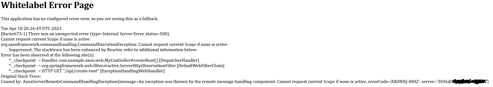

Repo for https://github.com/AxonFramework/extension-kotlin/issues/286

```bash
docker run -d --name axonserver -p 8024:8024 -p 8124:8124 -e AXONIQ_AXONSERVER_DEVMODE_ENABLED=true axoniq/axonserver
docker run -d --name postgres-axon -p 5432:5432 -e POSTGRES_PASSWORD=password postgres
```

# How to reproduce the error

Error is `Cannot request current Scope if none is active`

- Run axonserver locally
- Run postgres
- Launch Core app
- Launch Web app
- Go to url http://localhost:8080/api/create-root

Then will get error



- If replace `applyEvent(RootCreatedEvent(cmd.example))` by `AggregateLifecycle.apply(RootCreatedEvent(cmd.example))`
  of `RootCreateCmd` command handler then it will
  succeed to create the root aggregate
- Launch Core app
- Launch Web app
- Go to url http://localhost:8080/api/create-my-entity

Then will get error


- If replace `applyEvent(` by `AggregateLifecycle.apply(` of `RootMyEntityCreateCmd` command handler then it will succeed to
  create the entity
- Launch Core app
- Launch Web app
- Go to url http://localhost:8080/api/create-my-entity-level/0

Then will get error


